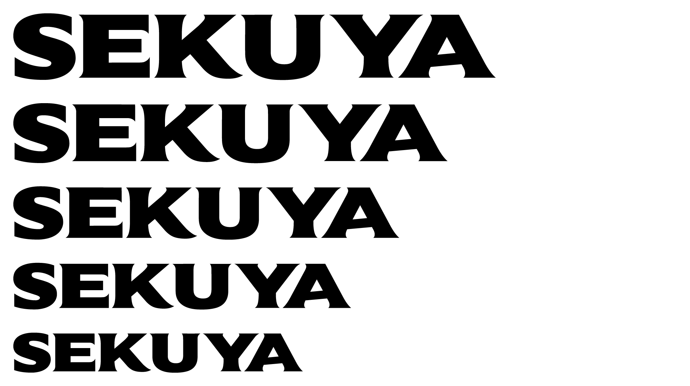
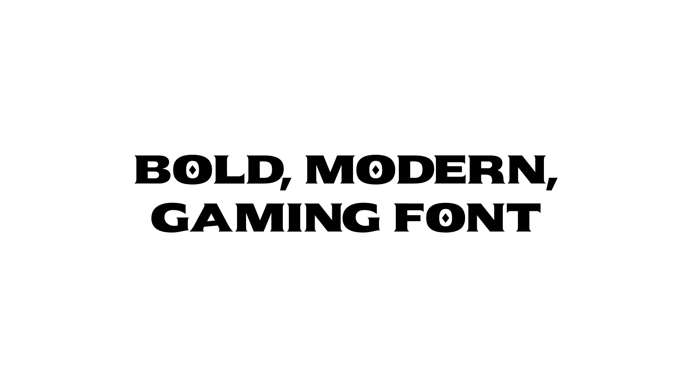
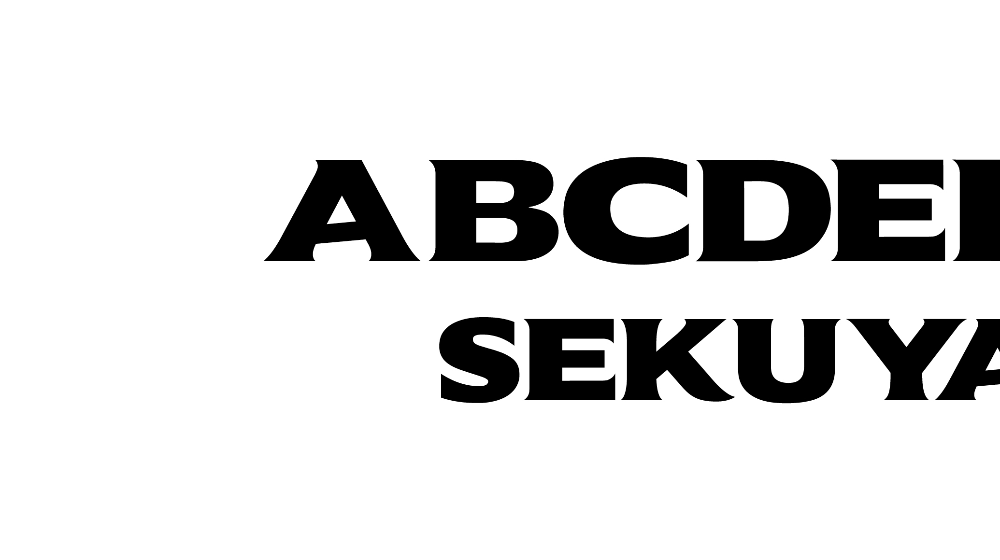
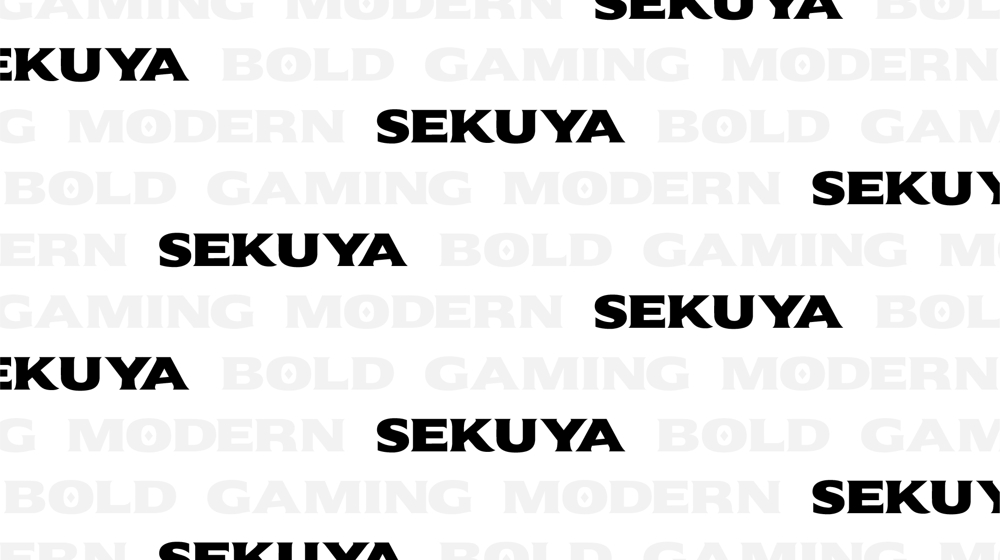

----

## SEKUYA

SEKUYA is a serif all-uppercase typeface that give a strong impression to your design. The main goal was to bring a boldness and modern feel
to serif font by reworking the curves also corners and balance of modern serif font families. This font is a great choice for main text / 
header text on a website or layout design. SEKUYA font originally created for SEKUYA game that has anime epic fantasy vibes. The font is free
for all to use. Learn more: [sekuya.io](sekuya.io)

----

## License

SEKUYA is licensed under SIL Open Font License V1.1, read [here](https://github.com/kevinnseptian/SEKUYA/blob/main/OFL.txt).

## ChangeLog

When you make modifications, be sure to add a description of your changes, following the format of the other entries, to the start of this section.

## Acknowledgements

